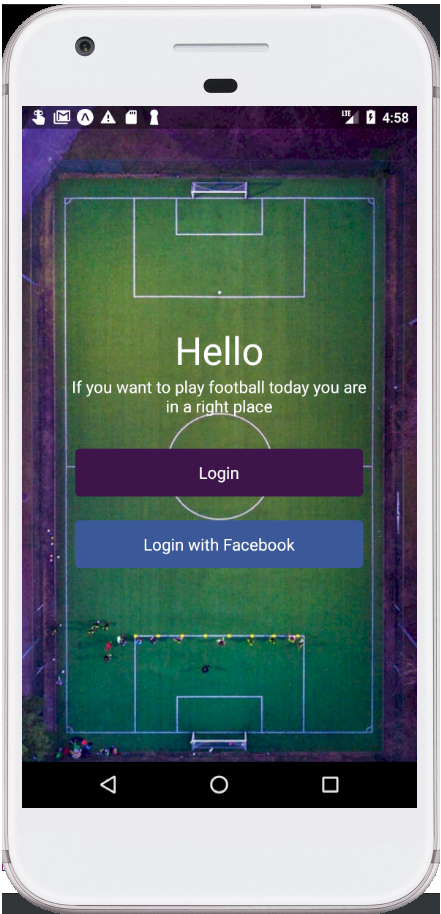

# Let's goal

This is a simple app in React Native that allows users of my app create and join other people games, edit thieir profile info and enjoy playing football 
games with strangers.

Front end of an app is done in React Native(only for android), the position of state manager was given to 
React-Redux and for backed i used Django.

## Demo

[](https://www.youtube.com/watch?v=Vy0HbI0DKj0&t)


### Prerequisites

What things you need to install the software and how to install them

Android Studio(android emulator) https://developer.android.com/studio/run/emulator

npm or yarn package manager https://yarnpkg.com/lang/en/

### Installing

Simply clone the repository

Type


```
yarn install
```

Wait until installation is finished. Then open the android emulator and in the same folder run command

```
npm run a
```

App should then run on your emulator.


## Built With

- [React Native](https://facebook.github.io/react-native/) - The mobile framework used
- [Django](https://www.djangoproject.com/) - The backend framework used
- [Django REST framework](https://www.django-rest-framework.org/) - framework used to make REST api
- [React Navigation](https://reactnavigation.org/) - navigation tool used in React Native
- [Redux](https://redux.js.org/) - app state manager

## Authors

- **Jarosław Glegoła** - _Core(and only) programmer_ - [KostkaBrukowa](https://github.com/KostkaBrukowa)

